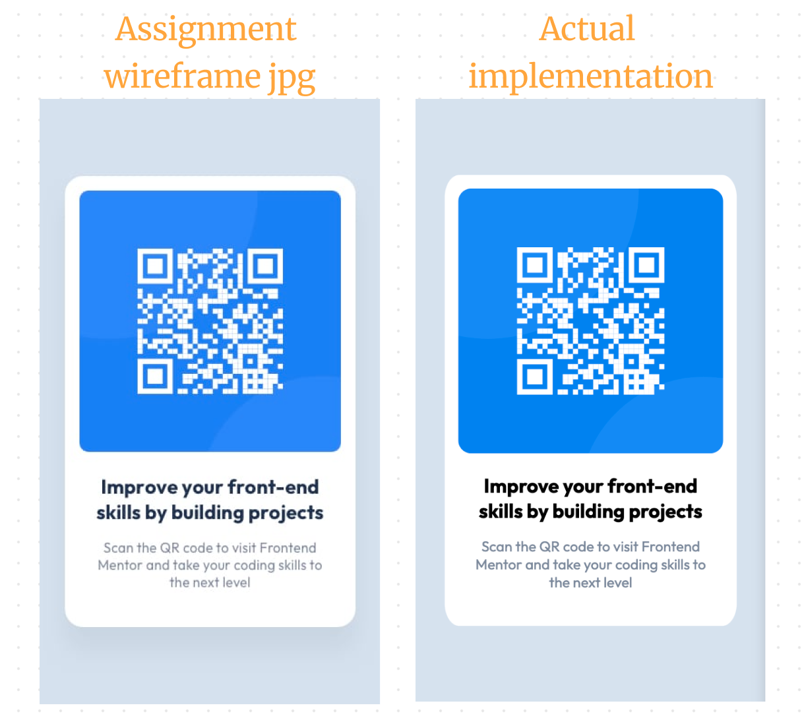

# Frontend Mentor - QR code component solution

This is a solution to the [QR code component challenge on Frontend Mentor](https://www.frontendmentor.io/challenges/qr-code-component-iux_sIO_H). Frontend Mentor challenges help you improve your coding skills by building realistic projects.

## Table of contents

- [Overview](#overview)
  - [Screenshot](#screenshot)
  - [Links](#links)
- [My process](#my-process)
  - [Built with](#built-with)
- [Author](#author)
- [Acknowledgments](#acknowledgments)

## Overview

Really enjoying working on Frontend Mentor materials! The challenges are very similar to the kinds of things I've seen in real-life #frontend #interview challenges. Can you spot any differences between the wireframe they gave and my implementation below? I'm thinking about doing solutions to challenges in vanilla CSS, Bootstrap, and Tailwind just for practice. Vanilla CSS solution shown below.

### Screenshot

### Links

- Solution URL: (https://github.com/masomaster/frontend-mentor-qr-code)
- Live Site URL: (https://masomaster.github.io/frontend-mentor-qr-code/)

## My process

I collected my resources (files, fonts, etc), sketched out the HTML files (divs inside divs inside divs), then get to work on the mobile-first CSS. This time around I wanted to do it in plain vanilla CSS, but I'd like to redo the project in Bootstrap and again in Tailwind.

### Built with

- Semantic HTML5 markup
- CSS custom properties
- Flexbox
- Mobile-first workflow

## Author

- Website - [Mason Lancaster](https://masonlancaster.com/)
- Frontend Mentor - [@masomaster](https://www.frontendmentor.io/profile/masomaster)

## Acknowledgments

Thanks to Frontend Mentor for making great practice resources!
Thanks also to David Kobrin for spotting minor differences to fix!
